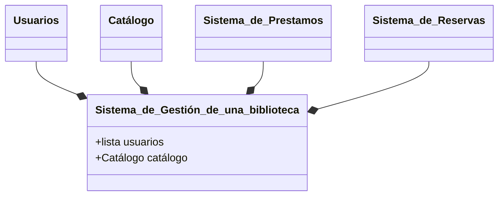
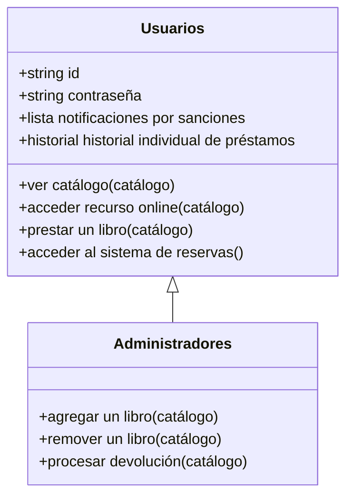
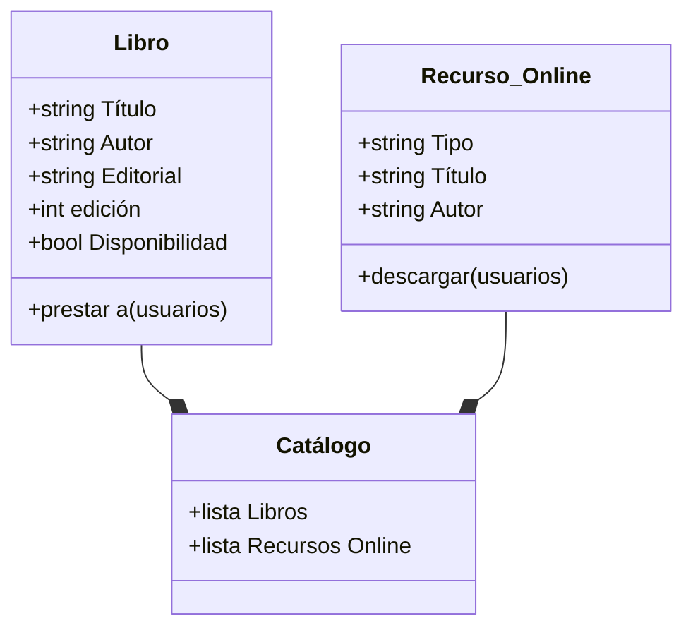
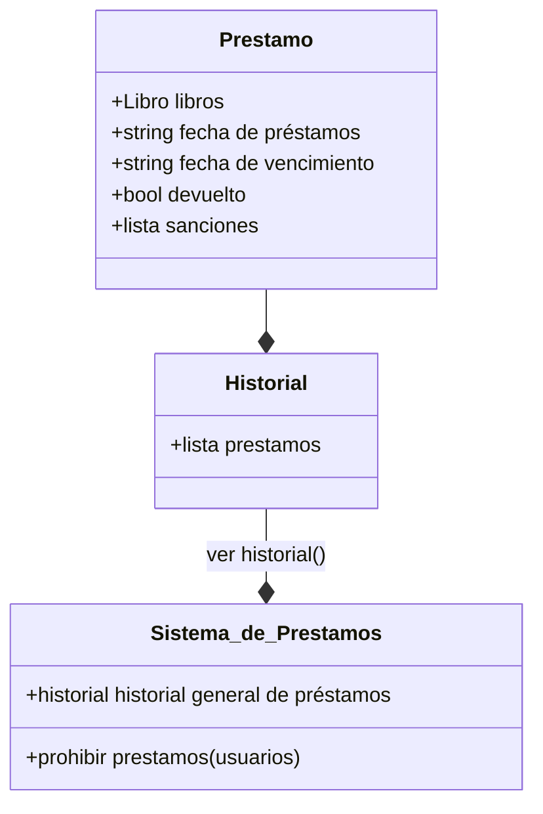
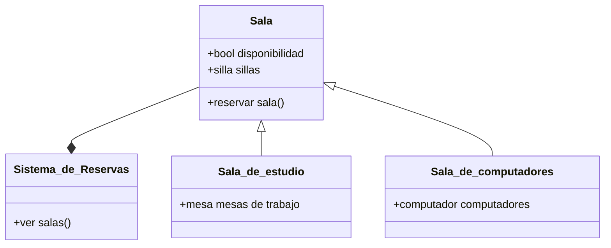
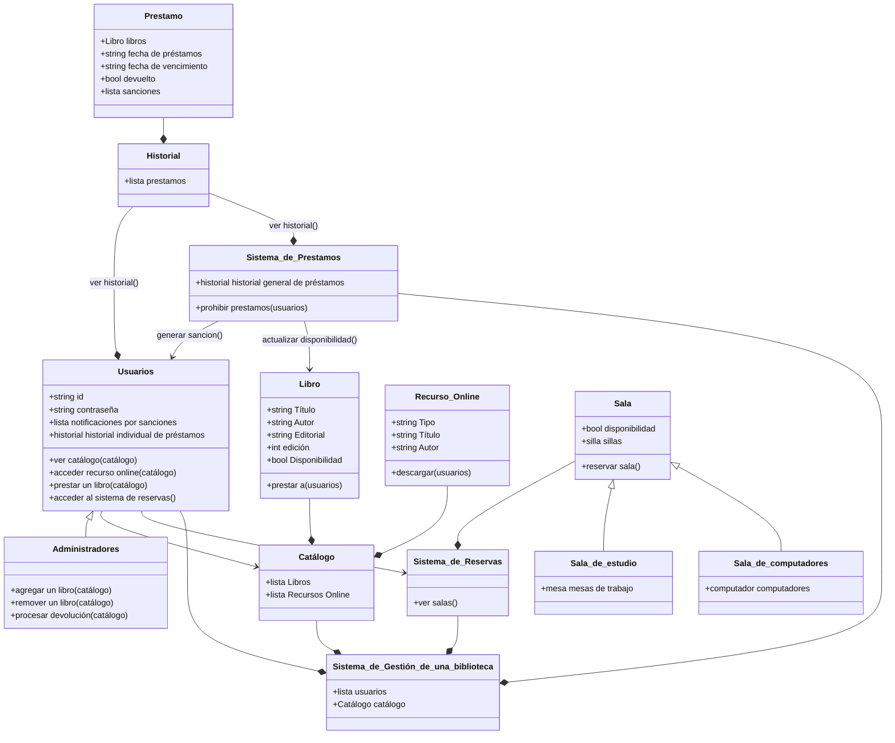

# Reto 2 POO
Para el segundo reto de la asignatura se pedía un diagrama UML de una situación real, representandolo en clases con sus propios atributos y métodos.

En mi caso escogí el sistema de gestión de una biblioteca, el cuál es el software utilizado tanto por administradores, como personas naturales para interactuar de una u otra forma con los objetos y espacios de la biblioteca.
***

## De manera general

## Usuarios

## Catálogo

## Préstamos

## Reserva de salas

## En conjunto
Finalmente, al unir todas las clases se obtiene la solución general:

