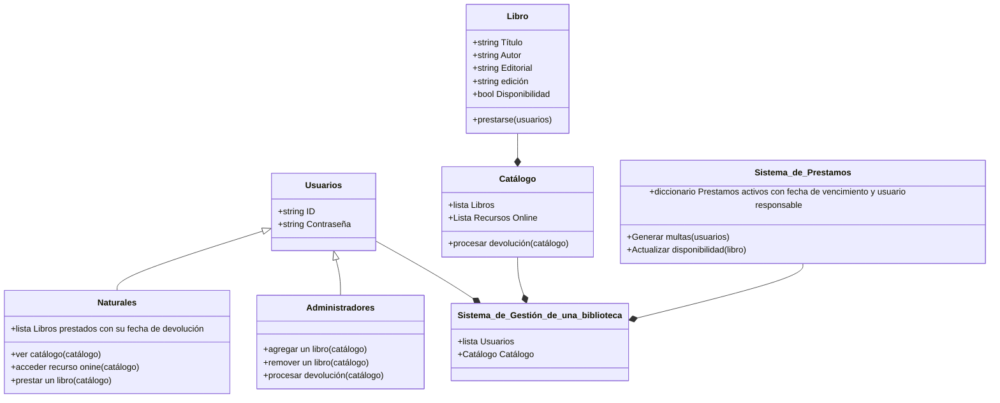

# Repo-2-Lucas-Garcia-curso-POO-Unal-
Solución a los ejercicios propuestos por el docente

```mermaid
classDiagram
    Usuarios <|-- Naturales
    Usuarios <|-- Administradores
    Libro --*  Catálogo
    Usuarios --*  Sistema_de_Gestión_de_una_biblioteca
    Catálogo --*  Sistema_de_Gestión_de_una_biblioteca
    Sistema_de_Prestamos --*  Sistema_de_Gestión_de_una_biblioteca

    class Sistema_de_Gestión_de_una_biblioteca{
      +lista Usuarios
      +Catálogo Catálogo
    }
    class Usuarios{
      +string ID
      +string Contraseña
    }
    class Naturales{
      +lista Libros prestados con su fecha de devolución
      +ver catálogo(catálogo)
      +acceder recurso onine(catálogo)
      +prestar un libro(catálogo)
    }
    class Administradores{
      +agregar un libro(catálogo)
      +remover un libro(catálogo)
      +procesar devolución(catálogo)
    }
    class Catálogo{
      +lista Libros
      +Lista Recursos Online
      +procesar devolución(catálogo)
    }
    class Libro{
      +string Título
      +string Autor
      +string Editorial
      +string edición
      +bool Disponibilidad
      +prestarse(usuarios)
    }
    class Sistema_de_Prestamos{
      +diccionario Prestamos activos con fecha de vencimiento y usuario responsable
      +Generar multas(usuarios)
      +Actualizar disponibilidad(libro)
    }
```
